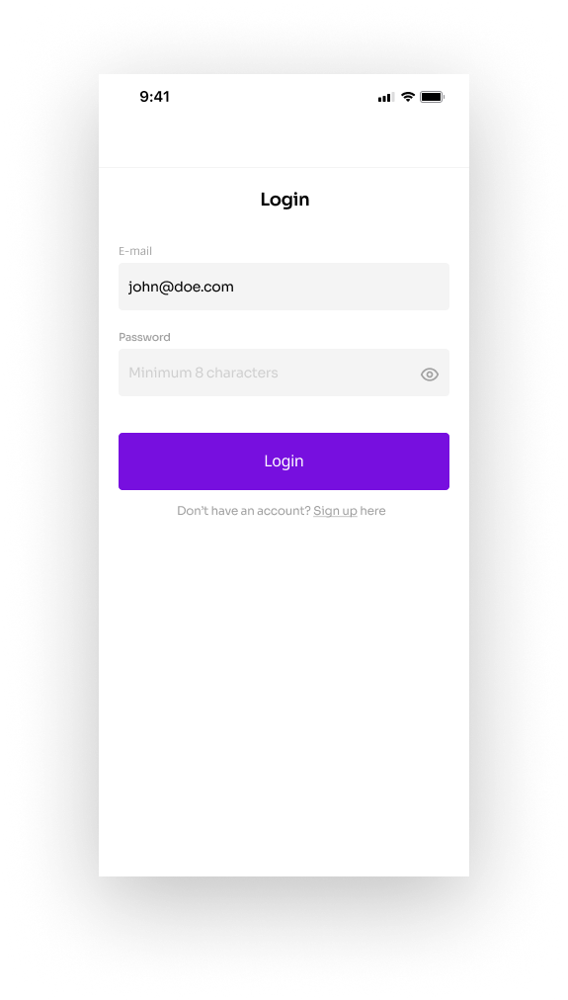
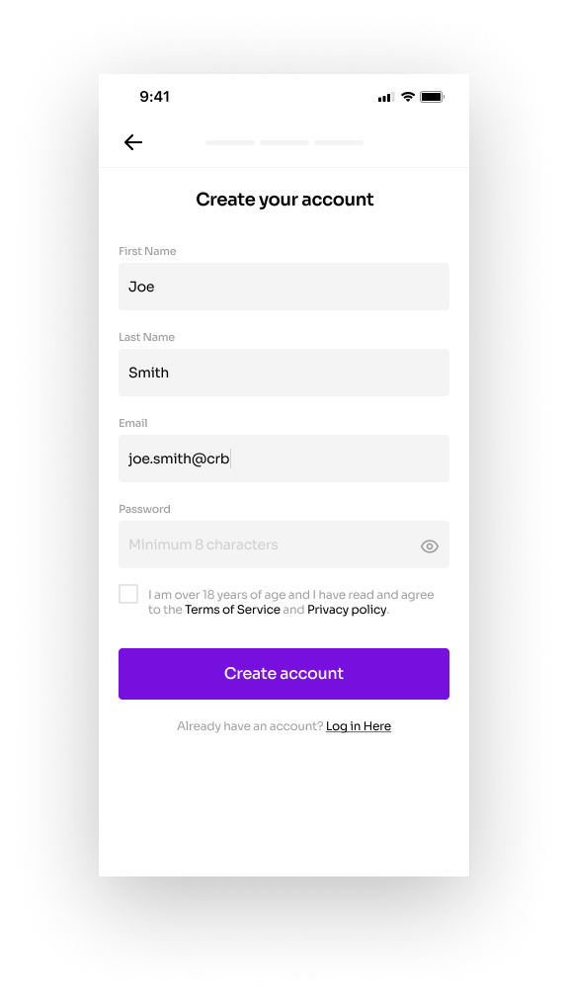
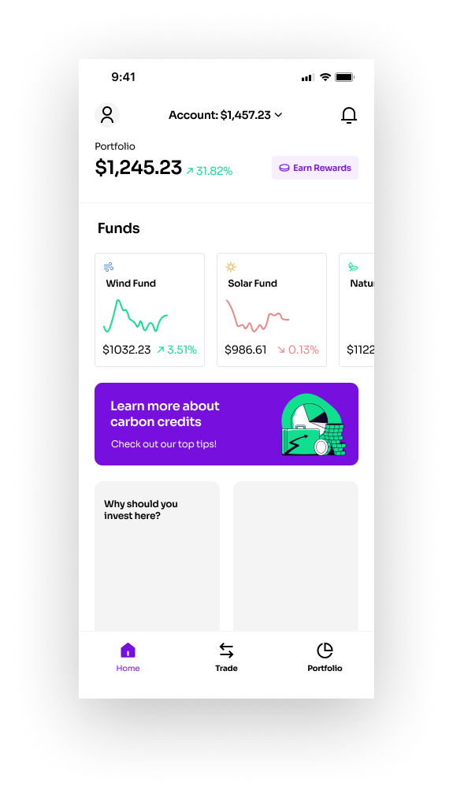

# energy-react-native

<p align="left">Energy Fund App.</p>

<p align="left">
  <a href="https://github.com/daviseares/energy-react-native/commits/master">
    
  </a>

  
</p>

<hr/>

## 📱 Screenshots

<p align="left">
  
  
  
</p>

## 🚀 Technologies

- [Redux](https://redux.js.org/)
- [Styled Components](https://www.typescriptlang.org/)
- [TypeScript](https://www.typescriptlang.org/)
- [React Native](https://facebook.github.io/react-native/)
- [React Navigation](https://reactnavigation.org/)


### 💻 Installation

```bash
# Clone this repository
$ git clone https://github.com/daviseares/energy-react-native.git

# Go into the repository
$ cd energy-react-native

# Install dependencies
$ yarn

# IOS
$ yarn ios

# Android
$ yarn android

# Tests
$ yarn test

```
## :memo: Licença


This project is licensed under the MIT license. See the file [LICENSE](LICENSE) for more details.

---

Made with ♥ &nbsp;by Davi Borges.
